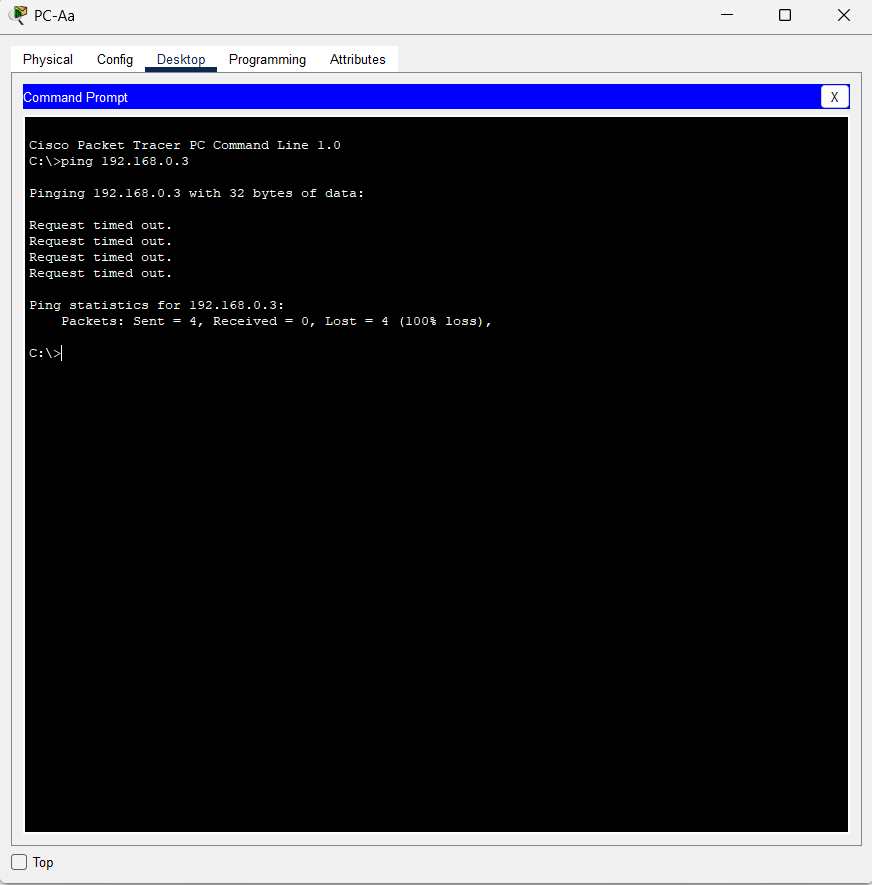

# 🧩 Praktikum Jaringan Komputer - Judul 2  
## Build a Switch and Router Network

### 📘 Deskripsi Singkat
Repository ini dibuat untuk memenuhi tugas akhir praktikum **Jaringan Komputer**, dengan fokus pada **konfigurasi dasar switch dan router** menggunakan perintah dasar Cisco IOS.  
Tujuan dari lab ini adalah membangun jaringan yang terdiri dari satu router, satu switch, dan dua PC, kemudian melakukan konfigurasi alamat IP (IPv4 & IPv6), pengujian konektivitas, serta menampilkan informasi antarmuka menggunakan perintah `show`.

Lab ini juga digunakan sebagai **dasar untuk implementasi jaringan pada pembuatan Tugas Akhir (TA)**.

---

### ⚙️ Langkah Umum
1. Menyusun topologi sesuai panduan lab.
2. Melakukan konfigurasi alamat IP pada router, switch, dan PC.
3. Mengaktifkan interface dengan perintah `no shutdown`.
4. Menguji konektivitas antar perangkat dengan perintah `ping`.
5. Menampilkan konfigurasi dan status menggunakan `show ip interface brief` dan `show ipv6 interface brief`.

---

### 🧠 Perangkat yang Digunakan
- 1 Router Cisco 4221 (IOS XE 16.9.4)
- 1 Switch Cisco 2960 (IOS 15.2)
- 2 PC (Windows / Packet Tracer)
- Kabel konsol & kabel Ethernet sesuai topologi

---

### 💻 Hasil Praktikum

**1️⃣ Hasil Ping Berhasil**

>   

**2️⃣ Hasil Ping Gagal**

>   

---

### 🎥 Dokumentasi Video
Link YouTube Praktikum: [Klik di sini](https://youtu.be/g5MnLwvgT3A)

---

### ✍️ Kesimpulan
Dari hasil praktikum, jaringan berhasil dibangun dan dikonfigurasi dengan benar. Semua perangkat dapat saling berkomunikasi menggunakan IPv4 maupun IPv6.  
Proses ini memperkuat pemahaman tentang **konfigurasi interface, pengaturan IP, dan verifikasi jaringan dasar** yang menjadi fondasi untuk proyek **TA (Tugas Akhir)** berbasis jaringan.

---

### 📅 Informasi
**Nama Praktikan:** *Cindy Puji Lestari*  
**NPM:** *2315061042*
**Mata Kuliah:** Jaringan Komputer  
**Praktikum:** Judul 2 - Build a Switch and Router Network  
**Laboratorium:** Cisco Networking / Lab TA
